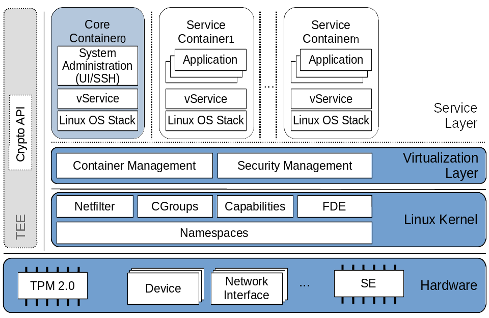

# GyroidOS Architecture

GyroidOS (/dʒaɪrɔɪd/) is a 
multi-arch OS-level virtualization solution with additional
focus on platform security based on hardware features.
It aims to support certification processes according to certain industry
standards, see [certification](../certification.md).
The core component, the virtualization layer, is based on
Linux-specific features like namespaces, cgroups and
capabilities to provide isolation of different Guest
Operating System (GuestOS) stacks on top of a single, shared Linux kernel.
In contrast to other _container_ solutions like Docker,
GyroidOS provides a small software stack footprint and additional
separation of privileged instances.
The illustration below shows the system architecture of GyroidOS.

{ width="75%" }

User interaction (e.g. admin access through ssh) may not directly end up in the
privileged root namespace. For that purpose a less privileged _core container_
exists, which is already _namespaced_ and may interact
with the privileged virtualization layer through a single specified interface only.
This can be compared to the dom0 approach of Xen.

Furthermore, special platform security features are
directly integrated into the virtualizaion layer in form of services
utilizing a TPM chip and other platform
dependent hardware-based security mechanisms.
In a nutshell, GyroidOS offers the following security features and benefits:

### Security features
* Solid container isolation based on modularized OS-level virtualization layer
* Secure boot (e.g. using UEFI on x86)
* Kernel module signing
* Signed GuestOSes (containers)
* Measured boot and remote attestation
* Full disk encryption coupled to TPM and secure boot
* Restriction of superuser in containers with Linux capabilities
* Fine-grained device access with device cgroups whitelists
* Secure Element support for two-factor authentication, e.g., when starting containers
* (upcoming) Relocation of cryptographic keys and ciphers into TEEs (e.g., Kernel Crypto API)
